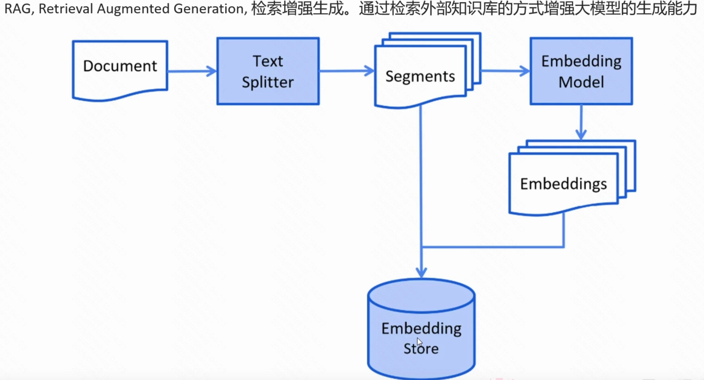

# 会话管理

无状态->会话记忆

重启丢失 - 持久化方案

进阶：超长上下文挑战：

存储挑战、传输tokens消耗 压缩问题、

# RAG「」

训练语料 无近来相关

引入外来知识库「」

## 原理

扩展到N维度、相似度越大 越接近

存储流程

例子

API：

加载方式

分词方式：行 正则 段落等等 

第三方向量模型导入

# Tools 「就是FC」

背景：用户预约 then 去调CRUD

